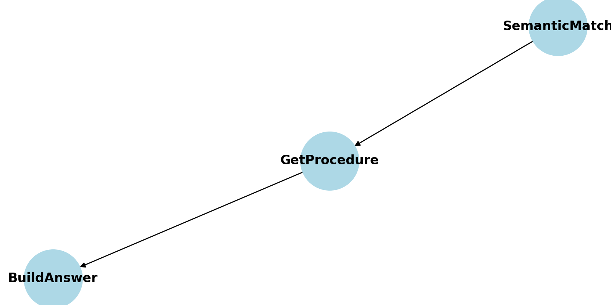
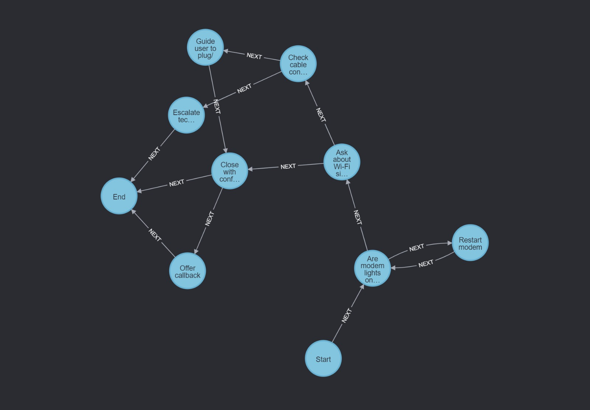
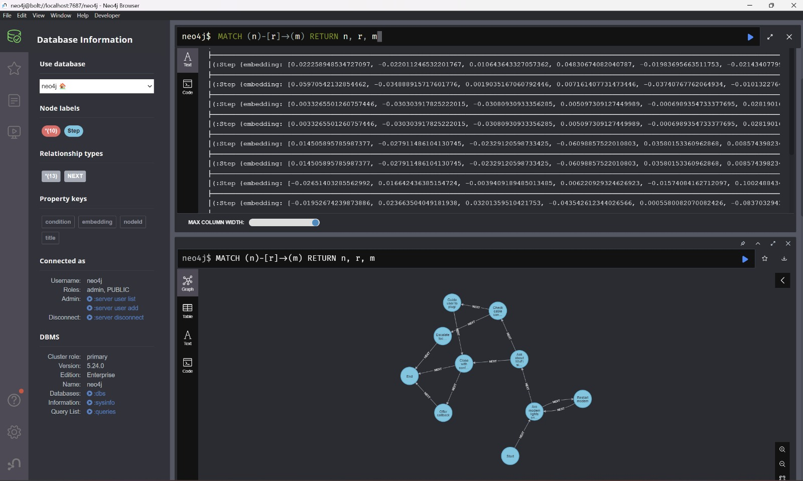
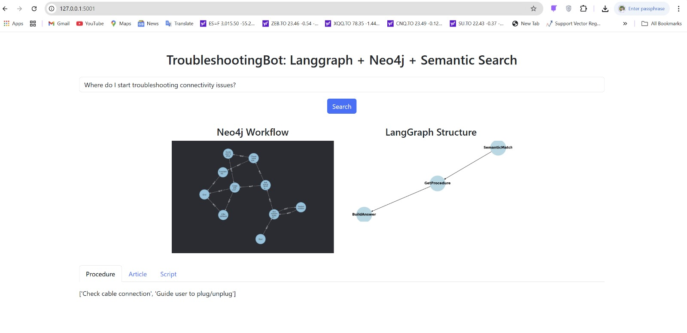
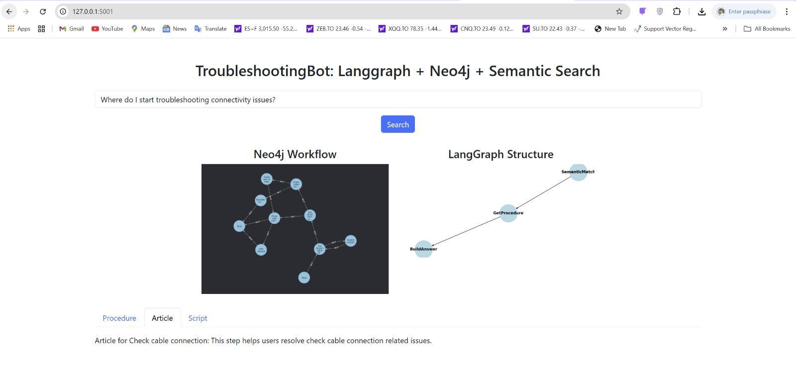
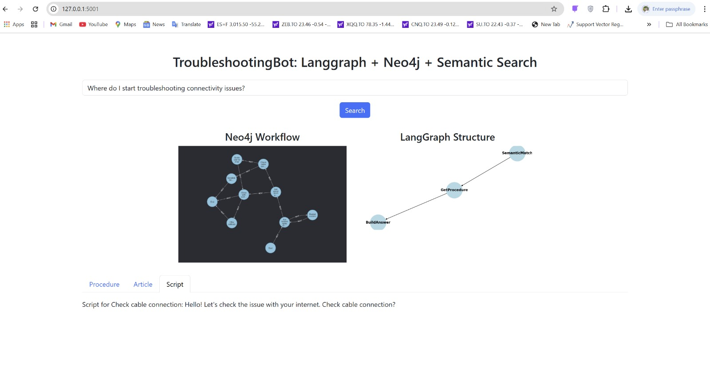

# TroubleshootingBot: LangGraph + Neo4j + Flask






This prototype demonstrates a semantic troubleshooting assistant that leverages:
- **Semantic Search** with SentenceTransformers
- **LangGraph** for flexible graph-based state management
- **Neo4j** as a vector-augmented knowledge graph
- **Flask** for the web-based UI

The goal is to perform semantic search over a Neo4j knowledge graph using query embeddings, retrieve related procedures, articles, and scripts, and visualize both the Neo4j workflow and LangGraph state machine structure.

---

## Key Features

- Embeddings are stored directly in Neo4j node properties (`embedding`)
- FAISS is removed — no external vector store
- Semantic similarity computed via cosine similarity between query and node embeddings
- Article and script are fetched dynamically from a separate `data.json` file
- Full visualization of:
  - Neo4j decision workflow (`static/Neo4j_3.png`)
  - LangGraph execution structure (`static/langgraph_structure_1.png`)
- Web interface (Flask) shows the two visualizations side-by-side with response tabs

---

## File Structure

```
.
├── assets/
│   ├── banner.png
│   ├── langgraph_structure_1.png
│   └── Neo4j_3.png
├── static/
│   ├── langgraph_structure_1.png
│   └── Neo4j_3.png
├── templates/
│   └── index.html
├── agent_graph.py               # LangGraph + Neo4j logic
├── agent_graph_ui.py           # Flask UI backend
├── app_neo_embd.py             # Embedding logic into Neo4j
├── data.json                   # Articles and Scripts
├── workflow.json               # Workflow logic
├── questions.text              # Sample queries
├── requirements.txt            # Dependencies
└── README.md                   # This file
```

---

---
## Architecture Overview

mermaid
graph TD
    SemanticMatch --> GetProcedure
    GetProcedure --> BuildAnswer

---

## How to Run

1. Ensure Neo4j is running on `bolt://localhost:7687` with default credentials.
2. Populate Neo4j using `app_neo_embd.py`
3. Launch the UI:
```bash
python `agent_graph_ui.py`
```
4. Open `http://127.0.0.1:5001` in your browser.

---
# Sample Output
- Query: "Where do I start troubleshooting connectivity issues?"

Procedure:

- Check cable connection
- Guide user to plug/unplug

- Script:
"Hello! Let's check the issue with your internet. Check cable connection?"
- Article:
"This step helps users resolve check cable connection related issues."

---
## Example Questions

Try any of these:
- “Are the modem lights important to check first?”
- “Should I restart the modem if the internet is not working?”
- “Can the customer request a callback if the issue remains?”




## Future Improvements

- Add support for more node types
- Use LangChain agents for dynamic query rewriting
- Integrate memory and session history
- Add LangChain tools or agent logic for deeper reasoning
- Store articles/scripts in Neo4j instead of JSON
- Export as a Dockerized microservice

---

"This prototype bridges data, structure, and AI reasoning for real-world customer support."

Created with passion by Zeinab Hajiabotorabi(zhabotorabi@gmail.com)
